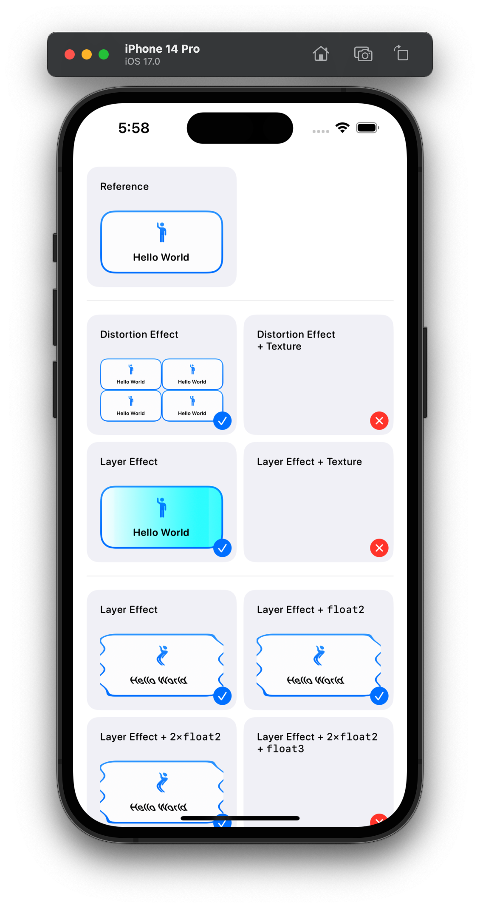

### ⚠️ Some if not all of these have been fixed in the latest beta, will update this repo when I have a moment.

Issues found so far (see [here](ShaderBugs/ContentView.swift)):

- Passing in an additional texture fails silently (distortion effect) or breaks the ability to sample the layer (layer effect).
  - The documentation on [`Shader.Argument.image`](https://developer.apple.com/documentation/swiftui/shader/argument/image(_:)) states:
    > Currently only one image parameter is supported per Shader instance.
    
    However, it's unclear to me if that would include the `SwiftUI::Layer` in the layer effect case?

- After a certain number (or size?) of arguments, shaders fail silently.

API limitations:

- I found no way to turn a dynamically compiled `MTLLibrary` into a `ShaderLibrary`. There is `ShaderLibrary(data:)` but it's unclear to me where this data would come from, other than disk.

- Run-time errors or at least console logs for argument mismatch would be highly appreciated.

- I found no way to sample what's behind the view to build e.g. custom a `Material`-like effect. There's ways to work around the limitation by installing the effect on the nearst common ancestor but that seems inefficient?
